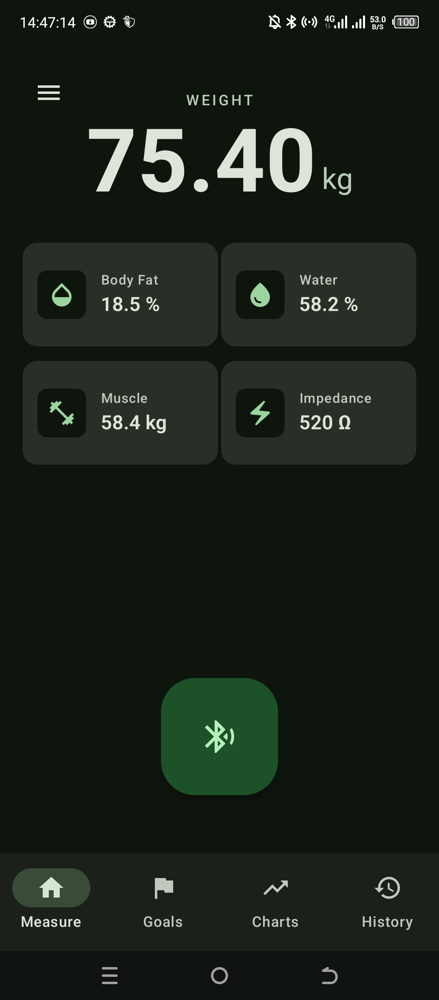
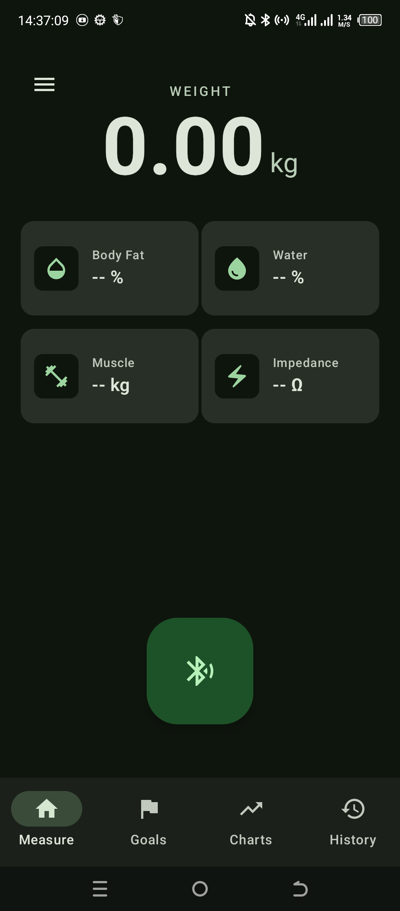
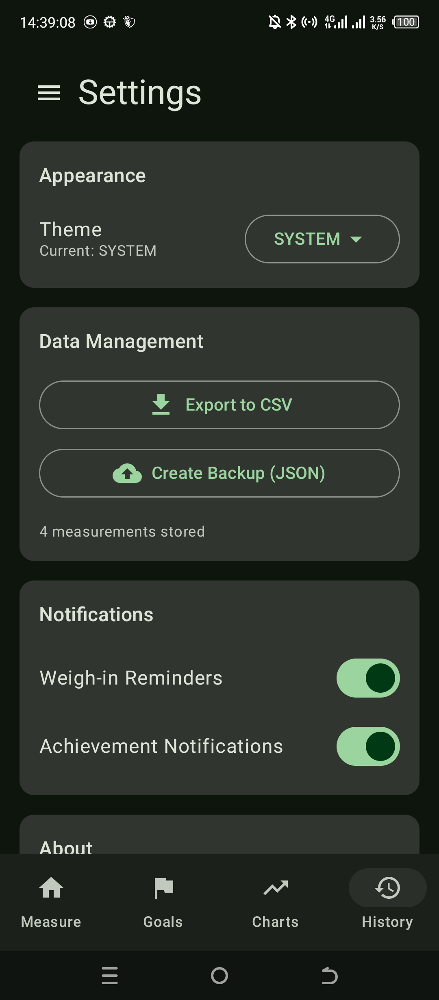
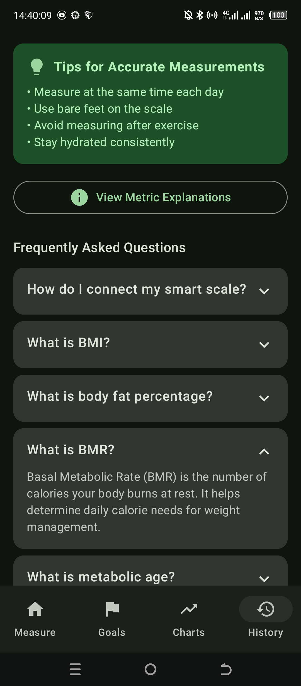

**Talon** is a modern, privacy-focused Android application for tracking body composition and fitness progress. Designed to work with Bluetooth smart scales, it provides detailed insights into your health metrics without relying on cloud services.

## ✨ Features

- **🧬 Scientifically Calibrated:** Body Fat algorithm derived from **59,430 clinical profiles** (CDC NHANES dataset).
- **📐 DEXA-Grade Accuracy:** Our formula correlates raw Bio-electrical Impedance (BIA) with medical Dual-Energy X-ray Absorptiometry (DEXA) scans, replacing generic commercial approximations.
- **⚡ Direct BLE Connection:** Reverse-engineered support for "OKOK" protocol scales (and compatible generic chipsets).
- **🚫 Ad-Free & Account-Free:** No cloud servers, no sign-ups, no ads. Your biometric data stays on your device.
- **🔗 Google Fit Integration:** Seamless sync using the modern Android Health Connect API.

### 📊 Comprehensive Metrics

Track more than just weight. Talon captures and analyzes:

- **Weight** & **BMI** (with color-coded categories)
- **Body Fat %**
- **Muscle Mass**
- **Water %**
- **Bone Mass**
- **Metabolic Age**
- **BMR** (Basal Metabolic Rate)
- **Impedance**

### **🔬 Scientific Basis**

Most generic smart scales use obscure, proprietary formulas to estimate Body Fat %. Talon takes a transparent, data-driven approach.

We trained a Linear Regression Machine Learning model on the **NHANES 1999-2004** dataset (National Health and Nutrition Examination Survey) provided by the US CDC. This specific period is considered the "Golden Age" of body composition data, as it contains both:

1.  **Input:** Raw BIA Resistance (Ohms) - _what your scale measures._
2.  **Ground Truth:** Whole-body DEXA Scans - _the medical gold standard for body fat._

**The Result:** A custom formula optimized on **59,430 real human profiles** to translate your scale's electrical resistance into meaningful health metrics with minimized error.

> **Formula logic:** `BodyFat% = f(Height²/Impedance, Weight, Age, Gender)`

### 📈 Visualization & Trends

- Interactive **Charts** for all metrics (powered by Vico)
- Filter data by **Week, Month, 3 Months, Year, or All Time**
- View key statistics: Average, Minimum, Maximum, and Change over time

### 🎯 Goal Tracking

- Set personalized goals for **Weight**, **Body Fat**, or **Muscle Mass**
- Track progress with visual indicators
- Set deadlines and receive achievement alerts

### 💾 Data Management

- **Offline First**: All data is stored locally on your device using Room Database.
- **Export**: Export your data to **CSV** for analysis in spreadsheets.
- **Backup**: Create full **JSON backups** of your history and settings.
- **Edit/Delete**: Full control to modify or remove incorrect measurements.

### ⚙️ Customization

- **Dark/Light Theme** support
- **Reminders**: Schedule daily weigh-in notifications
- **Onboarding**: Guided setup for new users

## 📸 Screenshots

|                         Measure Tab                         |                         Scanning UI                         |
| :---------------------------------------------------------: | :---------------------------------------------------------: |
|        |        |
|                       **Empty State**                       |                       **Navigation**                        |
|  |  |
|                        **Settings**                         |                          **Help**                           |
|           |               |

## 🛠️ Tech Stack

- **Android:** Kotlin, Jetpack Compose (Material 3), MVVM, Room Database.
- **Bluetooth:** Android BLE Scanner & GATT.
- **Data Science:** Python (pandas, scikit-learn) for algorithm calibration

<!-- end list -->

- **Language**: Kotlin
- **UI**: Jetpack Compose (Material 3)
- **Architecture**: MVVM (Model-View-ViewModel)
- **Local Storage**: Room Database (SQLite)
- **Asynchronous**: Coroutines & Flow
- **Charts**: Vico
- **Background Tasks**: WorkManager
- **Navigation**: Compose Navigation Suite

## 📂 Project Structure

The project follows a **layered architecture** based on Android best practices, separating concerns into UI, Data, and Domain layers:

```
com.aquilesorei.talon
├── ui/              # Presentation Layer
│   ├── screens/     # Composable screens (Home, History, etc.)
│   ├── components/  # Reusable UI components
│   └── theme/       # Theme definitions
├── domain/          # Domain Layer
│   ├── models/      # Business objects (Measurement, UserProfile)
│   └── usecases/    # Business logic
├── data/            # Data Layer
│   ├── local/       # Local storage (Room DB, DAOs, Entities)
│   └── repository/  # Single source of truth for data
├── viewmodels/      # State holders
├── workers/         # Background tasks (WorkManager)
└── utils/           # Utility classes
```

## 🚀 Getting Started

### Prerequisites

- Android Studio Ladybug or newer
- JDK 17+
- Android Device with Bluetooth LE support (min SDK 31 recommended)

### Installation

1.  Clone the repository:
    ```bash
    git clone https://github.com/Aquilesorei/talon.git
    ```
2.  Open the project in **Android Studio**.
3.  Sync Gradle files.
4.  Build and run on your device or emulator.

> **Note**: Bluetooth scanning requires a physical device. Emulators cannot scan for Bluetooth Low Energy devices.

## 📱 Usage

1.  **Connect Scale**: Go to the **Measure** tab and tap the Bluetooth icon to scan for your supported smart scale.
2.  **Weigh In**: Stand on the scale. The app will automatically capture your metrics.
3.  **Track**: Switch to the **Charts** tab to see your trends.
4.  **Set Goals**: Use the **Goals** tab to define your targets.
5.  **Settings**: Customize your theme and notification preferences in **Settings**.

## 🤝 Contributing

Contributions are welcome\! Please feel free to submit a Pull Request.

## 📄 License

This project is licensed under the MIT License - see the [LICENSE](https://www.google.com/search?q=LICENSE) file for details.
